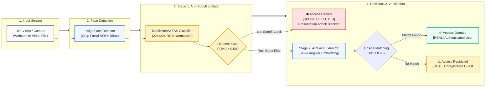

# Robust Face Anti-Spoofing & Biometric Verification System

<p align="center">
  <strong>Two-Stage Presentation Attack Detection (PAD) and Identity Verification Pipeline Under Extreme Illumination Variations</strong>
</p>

<p align="center">
  <a href="https://img.shields.io/badge/Python-3.10+-3776AB?style=flat&logo=python&logoColor=white"></a>
  <a href="https://img.shields.io/badge/Deep%20Learning-TensorFlow%202.15-FF6F00?style=flat&logo=tensorflow&logoColor=white"></a>
  <a href="https://img.shields.io/badge/Face%20Recognition-ArcFace%20%2F%20InsightFace-4285F4?style=flat"></a>
  <a href="https://img.shields.io/badge/Computer%20Vision-OpenCV-5C3EE8?style=flat&logo=opencv&logoColor=white"></a>
  <a href="https://img.shields.io/badge/Benchmark-OULU--NPU%20Protocol%204-009688?style=flat"></a>
  <a href="https://img.shields.io/badge/Type-Research%20Project-2563EB?style=flat"></a>
  <a href="https://img.shields.io/badge/Academic-BINUS%20University-ED1C24?style=flat"></a>
  <a href="https://img.shields.io/badge/Status-Completed-success?style=flat"></a>
</p>

---

<p align="center">
  <a href="#-overview">Overview</a> •
  <a href="#-key-features">Key Features</a> •
  <a href="#-architecture">Architecture</a> •
  <a href="#-benchmark-results-oulu-npu-protocol-4">Benchmark Results</a> •
  <a href="#-my-roles--contributions">Roles & Leadership</a> •
  <a href="#-tech-stack">Tech Stack</a> •
  <a href="#-repository-structure">Repository Structure</a> •
  <a href="#-getting-started">Quickstart</a>
</p>

---

> [!NOTE]
> **Academic Research Publication**  
> This project represents the research findings and functional implementation of our study:  
> **"Robust Face Anti-Spoofing under Lighting Variation Using Deep Pixel-wise Supervision on Lightweight CNNs"**  
> *Conducted at the School of Computer Science (SOCS), Bina Nusantara University (BINUS).*  
> 📄 Read the complete research paper: [`docs/Robust_Face_Anti_Spoofing_Paper.pdf`](docs/Robust_Face_Anti_Spoofing_Paper.pdf)

---

## 📌 Overview

Facial recognition is a central pillar of modern digital security, widely deployed across mobile operating systems, digital banking authentication, and automated physical access gates. However, standard facial recognition systems are fundamentally vulnerable to **presentation attacks (spoofing)**—including printed photographs, high-definition digital screen replays, and 3D silicone masks.

This vulnerability escalates dramatically in real-world deployments where **unpredictable ambient illumination, harsh glare, and deep shadows** cause conventional convolutional neural networks to fail or generate high false rejection rates.

This project delivers an **end-to-end, two-stage biometric authentication framework**:
1. **Stage 1 — Presentation Attack Detection (Liveness Gate)**: Evaluates whether the presented subject is bona fide (a real human) or an adversarial spoof presentation attack using lightweight Convolutional Neural Networks (**MobileNetV2 / EfficientNet-B0**) with illumination simulation augmentation.
2. **Stage 2 — Identity Verification (ArcFace)**: If and only if the subject passes the liveness test ($P(\text{live}) \ge 0.50$), high-dimensional 512-d ArcFace facial embeddings are extracted and matched against an enrolled gallery using cosine distance.

---

## ✨ Key Features

- **Adversarial Presentation Attack Defense**: Actively blocks printed 2D photos, tablet/smartphone video replays, and digital spoofing attempts before identity processing occurs.
- **Illumination-Resilient Training**: Incorporates dynamic brightness and illumination simulation jittering (`[0.5, 1.5]`), preventing the network from failing under extreme lighting conditions.
- **Edge-Optimized CNN Architecture**: Benchmarked specifically for resource-constrained edge devices, freezing pre-trained feature extractors to train with only **21,082 parameters**.
- **Real-Time Visual HUD & Telemetry**:
  - 🟢 **Green Bounding Box**: Bona fide live subject authenticated against registered identity database.
  - 🟠 **Amber Bounding Box**: Bona fide live subject but unregistered guest.
  - 🔴 **Red Bounding Box**: Presentation attack detected ($P(\text{live}) < 0.50$); immediate **ACCESS DENIED** banner with identity withheld.
  - ⚡ **Telemetry Overlay**: Real-time FPS monitoring and frame-skipping optimizations for smooth video processing.

---

## 🏗️ Architecture



---

## 🔬 Benchmark Results (OULU-NPU Protocol 4)

Our research benchmarked three lightweight, edge-compatible architectures on **Protocol 4 of the OULU-NPU benchmark** (evaluating generalization across unseen environmental illumination and diverse smartphone camera sensors):

| Model Backbone | Total Parameters | Trainable Parameters | APCER (%) | BPCER (%) | ACER (%) | Empirical Diagnosis |
| :--- | :---: | :---: | :---: | :---: | :---: | :--- |
| **ShuffleNetV2** | 1.25 M | 21,082 | 48.0% | 52.0% | 50.0% | Failed to converge; capacity too low |
| **MobileNetV2** | 2.22 M | 21,082 | 42.0% | 48.0% | 45.0% | Overfitted on illumination variations |
| **EfficientNet-B0** | **4.01 M** | **21,082** | **3.0%** | **27.0%** | **15.0%** | **Champion Baseline Model** |

### Key Metrics Defined:
- **APCER (Attack Presentation Classification Error Rate)**: $3.0\%$ — successfully identifies and blocks $97\%$ of adversarial presentation attacks.
- **ACER (Average Classification Error Rate)**: $15.0\%$ under unseen extreme illumination testing.
- **Explainability**: Spatial activation heatmaps confirm the network detects material anomalies and screen moiré artifacts rather than memorizing individual facial geometries.

---

## 👨‍💻 My Roles & Contributions

As the **Team Leader**, I supervised the entire research lifecycle, managed technical code quality, and directed the construction of the scientific paper under the mentorship of our university lecturer:

### 1. Dataset Acquisition & Institutional Licensing
- Took the initiative to identify the internationally recognized **OULU-NPU** mobile presentation attack dataset as the optimal evaluation benchmark for real-world lighting variations.
- Formally contacted and corresponded with the **University of Oulu (CMVS, Finland)** to secure official academic permission and the End User License Agreement (EULA) required for our research experiments.

### 2. Lecturer Mentorship & Research Supervision
- Collaborated closely under the continuous guidance of our university lecturer, translating theoretical academic research principles into disciplined, reproducible experimental methodology.
- Directed the technical design of the two-stage biometric verification architecture, establishing the boundaries between liveness evaluation and identity matching.

### 3. Codebase Auditing & Pipeline Refactoring
- Audited the software pipeline to identify and correct architectural oversights—specifically resolving an issue where the team's initial testing script bypassed the anti-spoofing model entirely.
- Refactored the monolithic training and inference scripts into modular, production-grade components with proper parameterization, exception handling, and real-time HUD telemetry.

### 4. Research Paper Architecture & Writing
- Led the conceptualization, structuring, and writing of the formal research paper: authored the **Methodology**, **System Implementation**, **Experimental Results**, and **Discussion** sections.
- Formulated the experimental setup comparing ShuffleNetV2, MobileNetV2, and EfficientNet-B0 under the OULU-NPU Protocol 4 benchmark.
- Analyzed and articulated the empirical trade-offs between model parameter scale, overfitting risks, and edge deployment feasibility.

---

## 💻 Tech Stack

| Domain | Technology / Library | Purpose |
| :--- | :--- | :--- |
| **Language** | Python 3.10 | Core programming language |
| **Deep Learning** | TensorFlow 2.15 / Keras | FAS MobileNetV2 model training, fine-tuning & serialization |
| **Face Recognition** | InsightFace (ArcFace) | Face detection, landmark alignment & 512-d embedding extraction |
| **Computer Vision** | OpenCV (cv2) | Video capture, frame preprocessing, BGR/RGB conversion & HUD |
| **Math & Similarity**| SciPy / NumPy | Cosine distance similarity calculations and matrix operations |
| **Dataset Benchmark**| OULU-NPU (Protocol 4) | Industry-standard presentation attack mobile dataset |

---

## 📂 Repository Structure

```
.
├── code_fas.py                     # MobileNetV2 FAS training & illumination augmentation pipeline
├── code_recognition.py             # Face enrollment & ArcFace 512-d embedding database generator
├── test_recognition.py             # Integrated Two-Stage real-time verification pipeline
├── model_fas_mobilenet.h5          # Pre-trained MobileNetV2 anti-spoofing model checkpoint
├── model_recognition_facenet.pkl   # Serialized ArcFace identity embeddings gallery
├── dataset_wajah/                  # Identity enrollment galleries (edwin, nicho, rafael, etc.)
├── docs/
│   └── Robust_Face_Anti_Spoofing_Paper.pdf  # Full formal academic research publication
├── .gitignore                      # Excludes large binaries, virtual environments & raw videos
└── README.md                       # Documentation and project manual
```

---

## 🚀 Getting Started

### 1. Prerequisites & Environment
Ensure you have Python 3.10 installed:

```bash
git clone https://github.com/EdwinAntoniee/Research_FAS.git
cd Research_FAS
pip install tensorflow insightface opencv-python scipy numpy
```

### 2. Enrolling Identities into Gallery
Place photos of each person in `dataset_wajah/<name>/` and run the enrollment encoder:

```bash
python code_recognition.py --dataset dataset_wajah --output model_recognition_facenet.pkl
```

### 3. Training the Anti-Spoofing Classifier
Train the MobileNetV2 liveness detection classifier with illumination simulation:

```bash
python code_fas.py --dataset dataset_lighting --epochs 10 --batch-size 32
```

### 4. Running Live Two-Stage Verification
Run live inference using your webcam (`--source 0`):

```bash
python test_recognition.py --source 0
```

Or run against a test video file:

```bash
python test_recognition.py --source "path/to/test_video.mp4"
```

*Press `q` on the video display window to terminate the pipeline.*